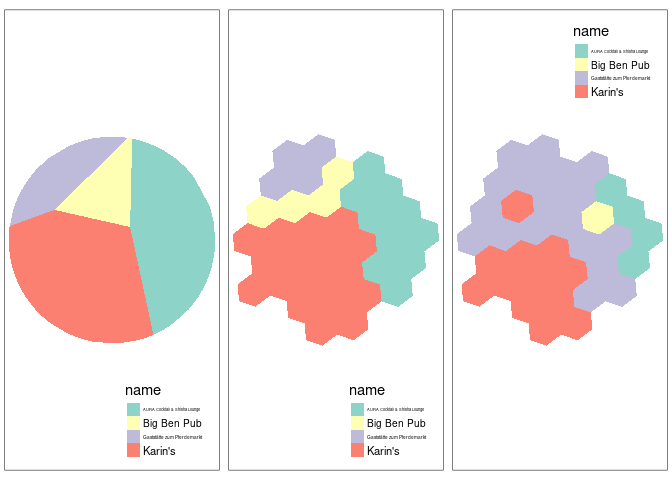

<!-- README.md is generated from README.Rmd. Please edit that file -->

# isonoi

<!-- badges: start -->

[](https://github.com/isonoi/isonoi/actions/workflows/R-CMD-check.yaml)
<!-- badges: end -->

The goal of isonoi is to provide example data and functions to
demonstrate the concept of ‘iso voronoi’ polygons.

It is designed to be a prototype implementation of ideas outlined and
demonstrated with example data and reproducible code in
<https://github.com/isonoi/isonoi>

Give it a spin with the reproducible examples shown below.

``` r
remotes::install_github("isonoi/isonoi")
```

``` r
# TODO: remove this and keep only library call
devtools::load_all()
#> ℹ Loading isonoi
# library(isonoi)
library(sf)
#> Linking to GEOS 3.11.1, GDAL 3.6.4, PROJ 9.1.1; sf_use_s2() is TRUE
x = net_oldenburg_raw
points = points_oldenburg
grid = iso_grid(x)
plot(grid, border = "grey")
plot(sf::st_geometry(x), add = TRUE)
plot(points, col = "red", add = TRUE, pch = 18, cex = 2)
#> Warning in plot.sf(points, col = "red", add = TRUE, pch = 18, cex = 2):
#> ignoring all but the first attribute
```

<!-- -->

The 3 figures below show outputs from the packages next to the standard
voronoi diagram.

``` r
library(tmap)
#> The legacy packages maptools, rgdal, and rgeos, underpinning the sp package,
#> which was just loaded, will retire in October 2023.
#> Please refer to R-spatial evolution reports for details, especially
#> https://r-spatial.org/r/2023/05/15/evolution4.html.
#> It may be desirable to make the sf package available;
#> package maintainers should consider adding sf to Suggests:.
#> The sp package is now running under evolution status 2
#>      (status 2 uses the sf package in place of rgdal)
poly = sf::st_convex_hull(sf::st_union(x))
vnoi = iso_vnoi(points, poly) # TODO
#> Warning in st_voronoi.sfc(sf::st_union(points), poly): st_voronoi does not
#> correctly triangulate longitude/latitude data
#> Warning: attribute variables are assumed to be spatially constant throughout
#> all geometries
vgrid = iso_vgrid(points, grid)
#> lon-lat points
#> Warning: st_centroid assumes attributes are constant over geometries
m1 = tm_shape(vnoi) + tm_fill("name")
m2 = tm_shape(vgrid) + tm_fill("name")
# m3 = iso_osrm(x) # TODO
tmap_arrange(m1, m2, m2, nrow = 1)
#> Some legend labels were too wide. These labels have been resized to 0.24, 0.62, 0.29. Increase legend.width (argument of tm_layout) to make the legend wider and therefore the labels larger.
#> Some legend labels were too wide. These labels have been resized to 0.24, 0.62, 0.29. Increase legend.width (argument of tm_layout) to make the legend wider and therefore the labels larger.
#> Some legend labels were too wide. These labels have been resized to 0.24, 0.62, 0.29. Increase legend.width (argument of tm_layout) to make the legend wider and therefore the labels larger.
```

<!-- -->
